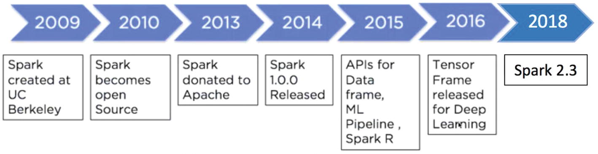
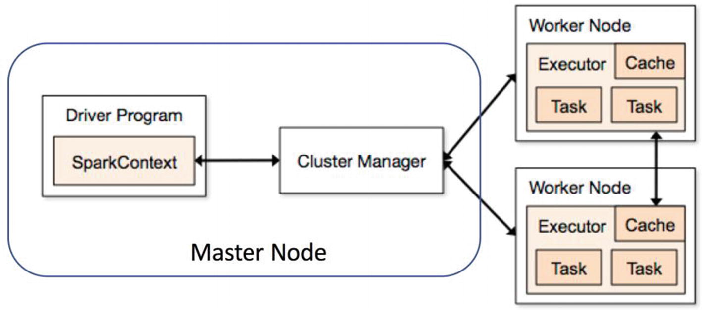

===============
Spark
===============
Apache Spark started as a research project at the UC Berkeley AMPLab in 2009 and was open sourced in early 2010. Since then, there has been no looking back. In 2016, Spark released TensorFrames for Deep Learning.

   
Under the hood, Spark uses a different data structure known as RDD (Resilient Distributed Dataset). It is resilient in a sense that they have an ability to re-create any point of time during the execution process. So RDD creates a new RDD using the last one and always has the ability to reconstruct in case of any error. They are also immutable as original RDDs remain unaltered. As Spark is a distributed framework, it works on master and worker node settings. The code to execute any of the activities is first written on Spark Driver, and that is shared across worker nodes where the data actually resides. Each worker node contains Executors that will actually execute the code. Cluster Manager keeps a check on the availability of various worker nodes for the next task allocation.

The prime reason that Spark is hugely popular is due to the fact that it’s very easy to use it for data processing, Machine Learning, and streaming data; and it’s comparatively very fast since it does all in-memory computations. Since Spark is a generic data processing engine, it can easily be used with various data sources such as HBase, Cassandra, Amazon S3, HDFS, etc. Spark provides the users four language options to use on it: Java, Python, Scala, and R.

===============
PySpark
===============
Apache Spark is written in Scala programming language. PySpark has been released in order to support the collaboration of Apache Spark and Python, it actually is a Python API for Spark. In addition, PySpark, helps you interface with Resilient Distributed Datasets (RDDs) in Apache Spark and Python programming language. This has been achieved by taking advantage of the Py4j library.PySpark Logo

Py4J is a popular library which is integrated within PySpark and allows python to dynamically interface with JVM objects. PySpark features quite a few libraries for writing efficient programs. Furthermore, there are various external libraries that are also compatible. Here are some of them:

PySparkSQL
===============
A PySpark library to apply SQL-like analysis on a huge amount of structured or semi-structured data. We can also use SQL queries with PySparkSQL. It can also be connected to Apache Hive. HiveQL can be also be applied. PySparkSQL is a wrapper over the PySpark core. PySparkSQL introduced the DataFrame, a tabular representation of structured data that is similar to that of a table from a relational database management system.

MLlib
==============
MLlib is a wrapper over the PySpark and it is Spark’s machine learning (ML) library. This library uses the data parallelism technique to store and work with data. The machine-learning API provided by the MLlib library is quite easy to use. MLlib supports many machine-learning algorithms for classification, regression, clustering, collaborative filtering, dimensionality reduction, and underlying optimization primitives.

GraphFrames
===============
The GraphFrames is a purpose graph processing library that provides a set of APIs for performing graph analysis efficiently, using the PySpark core and PySparkSQL. It is optimized for fast distributed computing.
Advantages of using PySpark: • Python is very easy to learn and implement. • It provides simple and comprehensive API. • With Python, the readability of code, maintenance, and familiarity is far better. • It features various options for data visualization, which is difficult using Scala or Java.

PySpark Streaming
===============
PySpark Streaming is a scalable, fault-tolerant system that follows the RDD batch paradigm. It is basically operated in mini-batches or batch intervals which can range from 500ms to larger interval windows.

In this, Spark Streaming receives a continuous input data stream from sources like Apache Flume, Kinesis, Kafka, TCP sockets etc. These streamed data are then internally broken down into multiple smaller batches based on the batch interval and forwarded to the Spark Engine. Spark Engine processes these data batches using complex algorithms expressed with high-level functions like map, reduce, join and window. Once the processing is done, the processed batches are then pushed out to databases, filesystems, and live dashboards.

.. image:: Pyspark-streaming.png
   :width: 400px

The key abstraction for Spark Streaming is Discretized Stream (DStream). DStreams are built on RDDs facilitating the Spark developers to work within the same context of RDDs and batches to solve the streaming issues. Moreover, Spark Streaming also integrates with MLlib, SQL, DataFrames, and GraphX which widens your horizon of functionalities. Being a high-level API, Spark Streaming provides fault-tolerance “exactly-once” semantics for stateful operations. 
