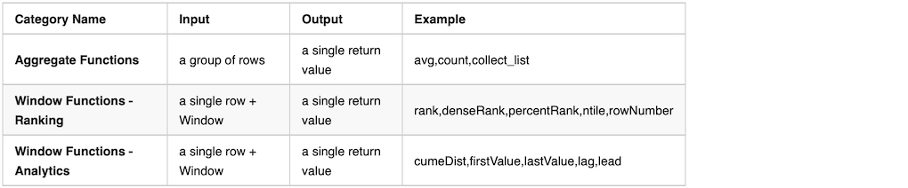
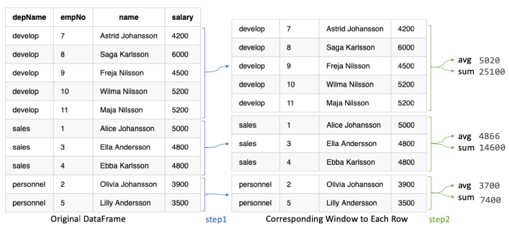

===============
Spark Functions
===============

Overview
==============
In this tutorial, I'm showing spark different function used with examples:
  a. Handling basic operation on dataframe like filters, updating or modifing column data etc in DataFrameBasicOperations.py,DataFrameBasics.py
  b. Handling aggresions like groupBy, orderBy, countDistinct, aggr-Max Min, sum etc in GroupBy&AggregateFunctions.py
  c. Implemented Pivot operations in pivotingFun.py
  d. Implemented Window Functions or Windowed Aggregates in windowsFun.py
  
Pivot Function:
================
Spark SQL provides pivot function to rotate the data from one column into multiple columns. It is an aggregation where one of the grouping columns values transposed into individual columns with distinct data. To get the total amount exported to each country of each product, will do group by Product, pivot by Country, and the sum of Amount.
  

Window Functions or Windowed Aggregates:
========================================
Window (also, windowing or windowed) functions perform a calculation over a set of rows. It is an important tool to do statistics. Most Databases support Window functions. Spark from version 1.4 start supporting Window functions.
  Spark Window Functions have the following traits:
    - perform a calculation over a group of rows, called the Frame.
    - a frame corresponding to the current row
    - return a new value to for each row by an aggregate/window function
    - Can use SQL grammar or DataFrame API.

There are hundreds of general spark functions in which Aggregate Functions and |Window Functions categories are related to this case.

Basic Frame with partitionBy:
-----------------------------
A Basic Frame has the following traits.
  - Created with Window.partitionBy on one or more columns
  - Each row has a corresponding frame
  - The frame will be the same for every row in the same within the same partition. (NOTE: This will NOT be the case with Ordered Frame)
  - Aggregate/Window functions can be applied on each row+frame to generate a single value
  

   
Range Frame
-----------------------------
We can use range functions to change frame boundary.
  - Create with Window.partitionBy on one or more columns
  - It usually has orderBy so that the data in the frame is ordered.
  - Then followed by rangeBetween or rowsBetween
  - Each row will have a corresponding frame
  - Frame boundary can be controlled by rangeBetween or rowsBetween
  - Aggregate/Window functions can be applied on each row+frame to generate a single value
